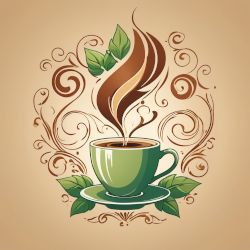
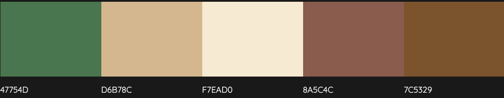

# Coffee Party

This site is created with HTML and Bootstrap 5. It is structured according to customer wishes, which you can find [here](#bootstrap-5---kaffeparty).

If you want to clone and run this project =>[Go to Get Started](#getting-started).

> ## My Notes
>
> ### Name & Logo
>
> Brew Haven
> 
>
> ### Color Palette
>
> 
>
> Deep Green  `#47754D`<br>
> Soft Beige  `#D6B78C`<br>
> Light Cream  `#F7EAD0`<br>
> Warm Brown  `#8A5C4C`<br>
> Dark Earthy Brown  `#7C5329`<br>
>
> <hr>

# Getting Started

```
git clone https://github.com/wongprom/kaffe_party.git
```

`cd in to project if needed`

and

```
npm install
```

### Prerequisites

VSCode extension

- [Live Server](vscode:extension/ritwickdey.LiveServer) - Launch a development local Server with live reload feature for static & dynamic pages

- [Live Sass Compiler](vscode:extension/glenn2223.live-sass) - Compile Sass or Scss to CSS at realtime.

### Run Project

In footer of VSCode

- click `Go Live`
- click `Watch Sass`

# Bootstrap 5 - Kaffeparty

## En första prototyp till företagssida

Ni har fått i uppdrag av ett nytänkande ungt företag vars kärnprocess är att leverera kaffe och kaffemaskiner till andra företag. De anordnar dessutom ett mycket omtyckt kaffeparty-event som både privatpersoner och företag kan beställa. På kaffepartyt presenteras en mängd olika kaffesorter som de får smaka tillsammans med mörk choklad och ges tillfälle att köpa produkterna.

Ni skall skapa en webbsida med tre sidor: “Index”, “Produkter” och “Om Oss”.

### För samtliga sidor (3 st):

- Ett passande och enhetligt färgtema
- Header; med logga eller företagsnamn (eller båda)
- Navbar; med länkar till samtliga sidor
- Footer; med copyright datum och webmaster

### Index:

- Uppdelad i fyra delar
  - Vilka är vi?
  - Vad gör vi?
  - Varför oss?
  - Kaffeparty, så fungerar det!
- Dess divar skall innehålla utfyllnads texter (Lorem Ipsum) och bilder. En snabb googlesökning ger bra bilder för en prototyp.

### Produkter:

- Separera Kaffeparty och Kaffemaskiner
- Lista kaffemaskiner, olika modeller med texter och bild
- Layouten ska vara delad i två delar
  - Kaffemaskiner
    - Listar kaffemaskiner i ett rutnät
    - Information, modell och pris syns tydligt
  - Kaffeparty
    - Uppdelad i två delar: Företag och Privatpersoner

### Om oss/Kontakt:

- Innehåller mer information om företaget
- Kontaktuppgifter med bild, telefonnummer, namn och e-post för VD
- Kontaktuppgifter med bild, telefonnummer, namn och mejl för HR-ansvarig

Sidan skall fungera lika bra på mobil som på en vanlig dator.

Denna övning är medvetet lämnad ganska öppen och är tänkt som en möjlighet att experimentera lite och testa olika delar av Bootstrap.

Lycka till!
